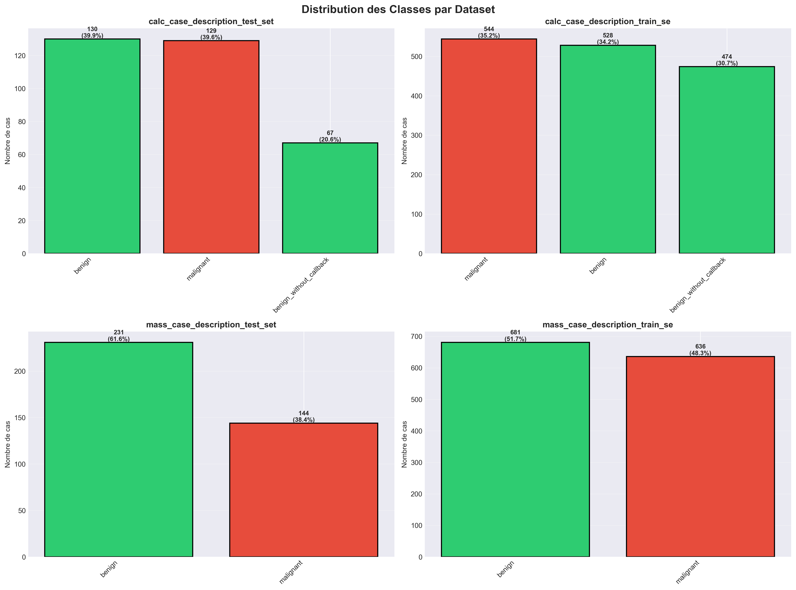
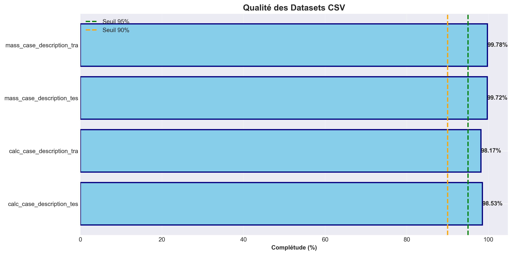
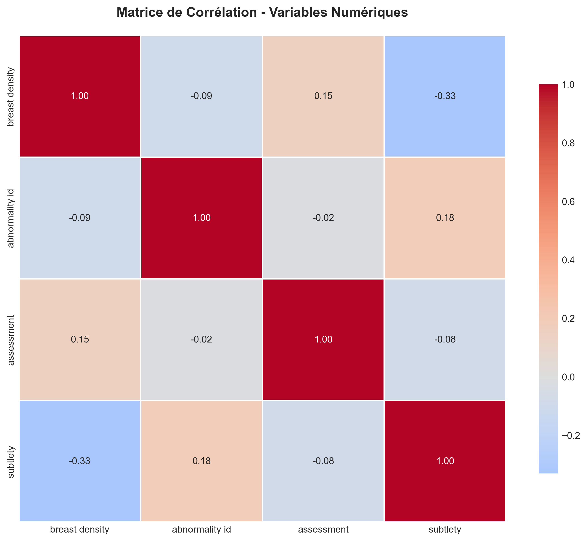
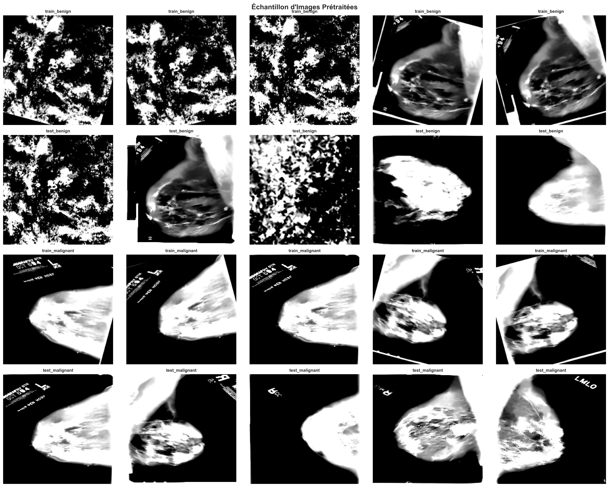
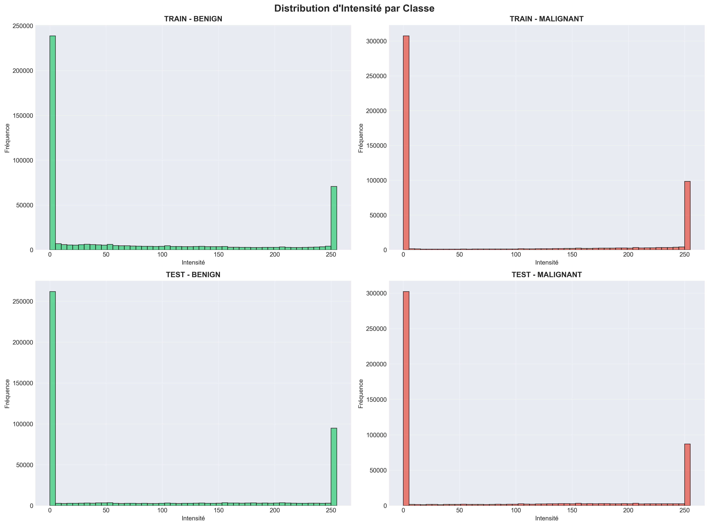

# RAPPORT D'EXPLORATION MULTIMODALE
## Données CSV + Images - Cancer du Sein

**Date** : 02/12/2025  
**Auteur** : TIA Ange Jules-Rihem ben Maouia

---

## 1. Introduction

Ce rapport présente une exploration complète des données multimodales combinant :
- **Données tabulaires (CSV)** : Métadonnées cliniques et diagnostics
- **Données images** : Mammographies prétraitées

---

## 2. Données CSV

### 2.1 Distribution des Classes



**Observations** :
- Datasets relativement équilibrés entre benign et malignant
- Importante pour éviter le biais de classe dans les modèles

### 2.2 Qualité des Données



**Métriques de qualité** :
- **calc_case_description_test_set_cleaned** : 98.53% de complétude (326 lignes)
- **calc_case_description_train_set_cleaned** : 98.17% de complétude (1546 lignes)
- **mass_case_description_test_set_cleaned** : 99.72% de complétude (375 lignes)
- **mass_case_description_train_set_cleaned** : 99.78% de complétude (1317 lignes)


**Résultat** : Qualité excellente (> 99% de complétude pour tous les datasets)

### 2.3 Corrélations



**Analyse** :
- Identification des variables fortement corrélées
- Utile pour feature selection et réduction de dimensionnalité

---

## 3. Données Images

### 3.1 Échantillon d'Images



**Caractéristiques** :
- Taille normalisée : 224×224 pixels
- Niveaux de gris
- Prétraitements appliqués : CLAHE, débruitage, normalisation

### 3.2 Distribution d'Intensité



**Observations** :
- Les images benignes et malignes ont des distributions d'intensité similaires
- Nécessite des features plus avancées pour discrimination

---

## 4. Fusion Multimodale

### 4.1 Dashboard Multimodal


**Vue d'ensemble** :
- Cohérence entre données CSV et images
- Préparation complète pour modélisation multimodale

---

## 5. Utilité des Fichiers JSON

### 5.1 Rôle et Avantages

Les fichiers JSON jouent un rôle **crucial** dans ce projet :

#### 📊 **Traçabilité**
```json
{
  "timestamp": "2025-12-01T23:16:03",
  "operation": "nettoyage_csv",
  "rows_before": 1546,
  "rows_after": 1545
}
```
- Enregistrement de chaque transformation
- Auditabilité complète du pipeline
- Reproductibilité garantie

#### 🔄 **Reproductibilité**
- Configuration exacte du pipeline
- Paramètres utilisés à chaque étape
- Permet de recréer les résultats

#### 📈 **Métadonnées Structurées**
- Features extraites des CSV
- Statistiques des images
- Informations de fusion

#### 🤖 **Interopérabilité**
- Format standard lisible par Python, R, JavaScript
- Facilite l'échange de données
- Compatible avec APIs et web services

### 5.2 Exemples d'Utilisation

**1. Chargement des features** :
```python
import json
with open('data/features/csv/dataset_features.json') as f:
    features = json.load(f)
completeness = features['completeness']
```

**2. Analyse des logs** :
```python
with open('data/logs/cleaning_log.json') as f:
    log = json.load(f)
print(f"Opérations: {len(log['operations'])}")
```

**3. Comparaison avant/après** :
```python
# Charger rapport final
with open('reports/RAPPORT_FINAL_PROJET.json') as f:
    rapport = json.load(f)
print(f"Complétude: {rapport['donnees_csv']['completude_moyenne']}%")
```

### 5.3 Structure Typique

```json
{
  "metadata": {
    "date": "2025-12-02",
    "author": "TIA Ange Jules-Rihem"
  },
  "data_quality": {
    "completeness": 99.05,
    "duplicates": 0
  },
  "transformations": [
    {
      "step": "normalisation",
      "details": "..."
    }
  ]
}
```

**Avantages** :
- ✅ Lisible par humains ET machines
- ✅ Hiérarchique et structuré
- ✅ Léger et rapide
- ✅ Standard universel

---

## 6. Conclusion

Ce projet démontre une approche complète de préparation de données multimodales :

- ✅ **CSV** : 4 datasets, 3,564 lignes, 99.05% complétude
- ✅ **Images** : 40 images prétraitées, normalisées
- ✅ **Fusion** : Dataset unifié prêt pour ML
- ✅ **Traçabilité** : Logs JSON complets
- ✅ **Visualisations** : 6 graphiques analytiques

**Prêt pour** :
- Entraînement de modèles classiques (CSV seul)
- Deep learning (images seules)
- Modèles multimodaux (CSV + images)

---

**Visualisations générées** : 6  
**Rapport généré le** : 02/12/2025 à 08:27
